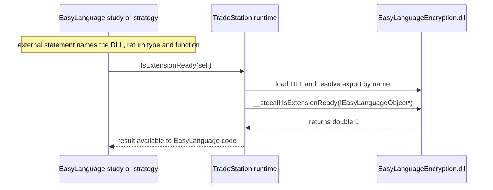

# EasyLanguageExtension

A native C++ DLL that extends TradeStation **EasyLanguage** with custom functions, built on the
[EasyLanguage Extension SDK](https://help.tradestation.com/10_00/eng/tsdevhelp/elword/help/easylanguage_extension_software_development_kit.htm)
(`tskit.dll`). The long-term goal is to expose encryption helpers (e.g. AES encrypt/decrypt) that
EasyLanguage strategies and indicators can call directly.

> **Status: early stage.** The DLL builds and exports a single health-check function. The
> encryption functions are not implemented yet — see [Current exports](#current-exports) and
> [Known limitations](#known-limitations).

## How it works

An EasyLanguage analysis technique declares the DLL function with an `external` statement and
passes its own `IEasyLanguageObject` pointer (`self`). TradeStation loads the DLL, looks the function
up by the name listed in the `.def` file, and calls it with the `__stdcall` convention.



## Current exports

| Function | EasyLanguage signature | Exported | Status |
| --- | --- | --- | --- |
| `IsExtensionReady` | `double IsExtensionReady(IEasyLanguageObject)` | Yes | Returns `1` — use it to check the DLL loads |
| `AESEncrypt` | `LPSTR AESEncrypt(IEasyLanguageObject, LPSTR)` | No | Stub, returns `NULL` |
| `AESDecrypt` | `LPSTR AESDecrypt(IEasyLanguageObject, LPSTR)` | No | Stub, returns `NULL` |

`Encryption.cpp` also contains `MyEncryptFile`, a file-encryption routine adapted from Microsoft's
[CryptoAPI sample](https://docs.microsoft.com/en-us/windows/win32/seccrypto/example-c-program-encrypting-a-file)
(RC4 with an MD5-derived key). It is not exported.

## Requirements

- Windows
- Visual Studio 2026 (v18) with the **Desktop development with C++** workload — the project uses
  the MSVC `v145` toolset. To build with Visual Studio 2022, retarget the project to `v143`.
- TradeStation 10.0 — provides `tskit.dll` and is needed to run the DLL. The Win32 configurations
  add `C:\Program Files (x86)\TradeStation 10.0\Program` to the reference path so `#import "tskit.dll"`
  can resolve it.

## Build

Open `EasyLanguageEncryption.sln` in Visual Studio and build, or run MSBuild from a
Developer Command Prompt / Developer PowerShell:

```bat
:: 32-bit DLL (solution platform is "x86", which maps to the Win32 project configuration)
msbuild EasyLanguageEncryption.sln -p:Configuration=Release -p:Platform=x86

:: 64-bit DLL
msbuild EasyLanguageEncryption.sln -p:Configuration=Release -p:Platform=x64
```

| Solution platform | Output |
| --- | --- |
| `x86` | `Release\EasyLanguageEncryption.dll` (or `Debug\`) |
| `x64` | `x64\Release\EasyLanguageEncryption.dll` (or `x64\Debug\`) |

Pick the build whose bitness matches your TradeStation installation — a 32-bit process cannot load
a 64-bit DLL, and vice versa.

## Usage in EasyLanguage

1. Copy `EasyLanguageEncryption.dll` into the TradeStation `Program` directory
   (for example `C:\Program Files (x86)\TradeStation 10.0\Program`), or reference it by absolute path.
2. Declare and call the function:

```text
external: "EasyLanguageEncryption.dll", double, "IsExtensionReady", IEasyLanguageObject {self};

variables:
    double Ready( 0 );

Ready = IsExtensionReady( self );
if Ready = 1 then
    Print( "EasyLanguageEncryption.dll is loaded" );
```

`external method:` passes `self` automatically, so this declaration is equivalent:

```text
external method: "EasyLanguageEncryption.dll", double, "IsExtensionReady";
```

The function name inside the `external` statement is **case-sensitive**.

## Adding a new function

1. Implement it in `Encryption.cpp` with the `__stdcall` calling convention and
   `IEasyLanguageObject*` as the first parameter:

   ```cpp
   double __stdcall MyFunction(IEasyLanguageObject* pELObject, int nLength);
   ```

2. Map types between EasyLanguage and C++:

   | EasyLanguage | C++ |
   | --- | --- |
   | `IEasyLanguageObject` | `IEasyLanguageObject*` |
   | `double` / `float` / `int` / `int64` | `double` / `float` / `int` / `__int64` |
   | `string` or `LPSTR` | `LPSTR` or `char*` |

3. Add the unadorned name under `EXPORTS` in `EasyLanguageEncryption.def` — functions not listed
   there are invisible to TradeStation.
4. Rebuild, copy the DLL, and declare the function with `external` in EasyLanguage.

The type mapping and calling rules above come from the TradeStation
[EasyLanguage Extension SDK reference (PDF)](https://cdn.tradestation.com/uploads/EasyLanguage-Extension-SDK.pdf).

## Project structure

| Path | Purpose |
| --- | --- |
| `Encryption.cpp` | Exported EasyLanguage functions and the CryptoAPI encryption routine |
| `EasyLanguageEncryption.def` | Export list — every EasyLanguage-callable function must appear here |
| `dllmain.cpp` | Standard `DllMain` entry point (no per-attach logic) |
| `pch.h`, `pch.cpp`, `framework.h` | Precompiled header; pulls in `<windows.h>` |
| `json.h`, `json.cpp` | Bundled [json-parser](https://github.com/json-parser/json-parser) (compiled, not yet used) |
| `3rd-party/` | Copies of jsoncpp 1.9.5 and json-parser headers (not part of the build) |
| `EasyLanguageEncryption.sln`, `.vcxproj` | Visual Studio solution and project |

## Known limitations

- **The SDK type library is not imported yet.** `#import "tskit.dll"` sits above
  `#include "pch.h"` in `Encryption.cpp`. With precompiled headers, MSVC skips every line before
  that include, so no `tskit.tlh` is generated and `IEasyLanguageObject` is only forward-declared.
  Move the `#import` below `#include "pch.h"` before calling any SDK interface members. The x64
  configurations do not set the TradeStation reference path, so add it there too.
- **Character sets differ by platform.** x64 builds use Unicode and Win32 builds use MBCS, so
  `TEXT()` / `LPTSTR` change meaning between them. Strings crossing the EasyLanguage boundary are
  always ANSI (`LPSTR`).
- **Do not resize EasyLanguage strings inside the DLL.** The SDK allows reordering the characters of
  a string passed in, but not changing its length.
- **`MyEncryptFile` is not suitable for protecting sensitive data.** RC4 and MD5 key derivation are
  obsolete; the planned AES functions are intended to replace it.

## Third-party code

- [json-parser](https://github.com/json-parser/json-parser) — BSD 2-Clause license (see the header
  of `json.h`).
- [jsoncpp](https://github.com/open-source-parsers/jsoncpp) 1.9.5 — Public Domain / MIT license;
  under `3rd-party/`, not compiled.

## Trademarks

TradeStation® and EasyLanguage® are registered trademarks of TradeStation Technologies, Inc. This
project is not affiliated with or endorsed by TradeStation.
